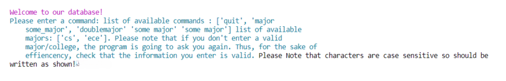
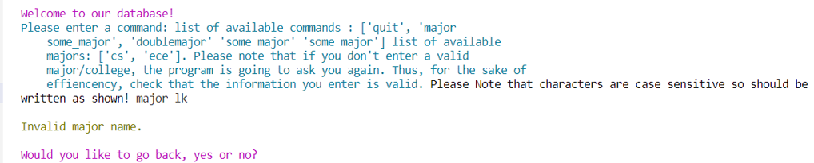

# Academic Navigator 

The project's vision is to create a user-friendly application that helps students navigate their college course selection process. My goal is to provide various tools and features that will make the experience more convenient and personalized for the student. Some features of the project include:
 
•I successfully parsed data from the Cornell class roster API, which allowed us to provide students with the most up-to-date information on available courses.
 
•I implemented a feature that allows students to sort classes based on their preferred time frames, making it easier for them to create a schedule that works for them. For instance, the student can ask the engine to output classes occuring at certain time frame such as the morning.
 
•I added a GPA calculator to our application, which will help students monitor their academic progress throughout their college years.
 
•I gave students the ability to go back and fix their input or quit the application at any time, ensuring that their experience with the application is as stress-free and flexible as possible.
 

The engine first starts by welcoming the user to the database. Then, it informs the user of the available comamnds that he can input such as major 'some major' or quit command.
 
 
The engine has verifiability, meaning if you input an invalid command or even invalid major whether in the ___major___ or **_doublemajor**_ command, it will promp you to enter the right one. For example, if the user inputted **_major lk_** where **_lk_** is not a valid major, the engine will let the user know of such mistake and will ask if the user would like correct the error.
 	  

	     

 The engine will then ask  the user to input the college as one major could exist in different colleges and would thus have different requirements based on that. 
	    If the college inputted by the user is invalid, the engine would let the user know of such error and promt him to reenter the choice as shown below.
